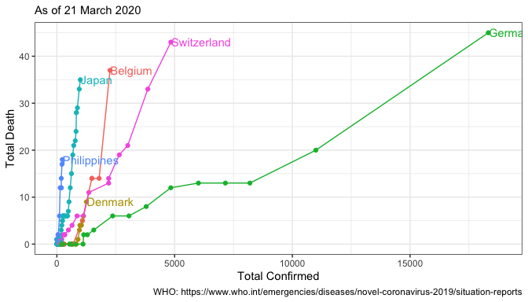
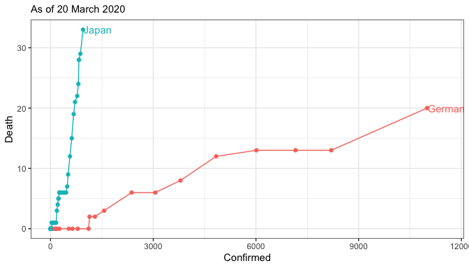
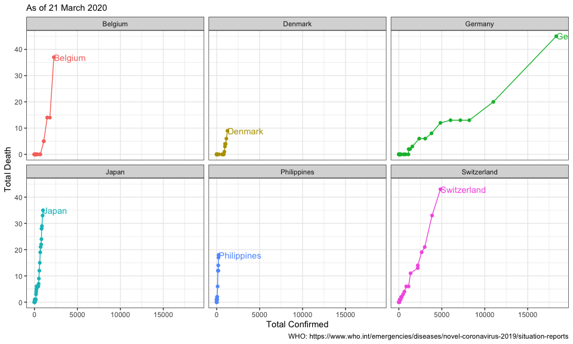

## link: [WHO Coronavirus disease (COVID-2019) situation reports](https://www.who.int/emergencies/diseases/novel-coronavirus-2019/situation-reports/)


```r
dat <- 
  "data/dat_cofdeath.csv" %>% 
  read.csv(stringsAsFactors = F) %>% 
  group_by(Area) %>% 
  mutate(Date = ymd(Date)) %>% 
  arrange(desc(Date)) %>% 
  ungroup()

.xmax <- dat$Confirmed %>% max() %>% {. + 500}

g <-
  dat %>% 
  ggplot()+
  aes(Confirmed, Death, color = Area)+
  geom_point()+
  geom_path()+
  geom_text(data = dat %>% 
              group_by(Area) %>% 
              filter(Death == max(Death) & 
                       Confirmed == max(Confirmed)),
            aes(label = Area, x = Confirmed + 20),
            hjust = 0)+
  scale_x_continuous(limits = c(0, .xmax))+
  theme_bw()+
  theme(legend.position = "none")+
  labs(subtitle = .subtitle)+
  xlab("Total Confirmed")+
  ylab("Total Death")
g
```

<!-- -->

```r
g_jp_G <-
  dat %>%
  filter(Area %in% c("Japan", "Germany")) %>% 
  ggplot()+
  aes(Confirmed, Death, color = Area)+
  geom_point()+
  geom_path()+
  geom_text(data = dat %>% 
              filter(Area %in% c("Japan", "Germany")) %>% 
              group_by(Area) %>% 
              filter(Death == max(Death) & 
                       Confirmed == max(Confirmed)),
            aes(label = Area, x = Confirmed + 20),
            hjust = 0)+
  scale_x_continuous(limits = c(0, .xmax))+
  theme_bw()+
  theme(legend.position = "none")+
  labs(subtitle = .subtitle)

g_jp_G
```

<!-- -->


```r
g + 
  facet_wrap(~Area)
```

<!-- -->


```r
dat_week <-
  dat %>% 
  mutate(Date = ymd(Date)) %>% 
  arrange(desc(Date)) %>% 
  group_by(Area) %>% 
  mutate(tag = if_else(Date == max(Date), 0, 1),
         tag = cumsum(tag) %% 7)

dat_week %>% 
  ggplot()+
  aes(Confirmed, Death, color = Area)+
  geom_point()+
  geom_path()+
  geom_text(data = dat %>% 
              group_by(Area) %>% 
              filter(Death == max(Death) & 
                       Confirmed == max(Confirmed)),
            aes(label = Area, x = Confirmed + 20),
            hjust = 0)+
  geom_vline(data = dat_week %>% filter(tag == 0),
             aes(xintercept = Confirmed), linetype = "dotted")+
  scale_x_continuous(limits = c(0, .xmax))+
  theme_bw()+
  theme(legend.position = "none")+
  facet_wrap(~Area)+
  labs(subtitle = .subtitle)
```

<!-- -->


```r
dat_week %>% 
  filter(Area %in% c("Japan", "Germany")) %>% 
  ggplot()+
  aes(Confirmed, Death, color = Area)+
  geom_point()+
  geom_path()+
  geom_text(data = dat %>% 
              filter(Area %in% c("Japan", "Germany")) %>%
              group_by(Area) %>% 
              filter(Death == max(Death) & 
                       Confirmed == max(Confirmed)),
            aes(label = Area, x = Confirmed + 20),
            hjust = 0)+
  geom_vline(data = dat_week %>%
               filter(tag == 0) %>%
               filter(Area %in% c("Japan", "Germany")),
             aes(xintercept = Confirmed), linetype = "dotted")+
#  scale_x_continuous(limits = c(0, 3000))+
  theme_bw()+
  theme(legend.position = "none")+
  facet_wrap(~Area, scales = "free_x")+
  labs(subtitle = .subtitle)
```

<!-- -->


```r
dat %>% 
  filter(Area == "Germany") %>% 
  filter(Death >= 2) %>% 
  lm(Death ~ Confirmed, data = .) %>% 
  summary()
```

```
## 
## Call:
## lm(formula = Death ~ Confirmed, data = .)
## 
## Residuals:
##     Min      1Q  Median      3Q     Max 
## -2.2162 -0.7682 -0.2513  0.7138  2.6487 
## 
## Coefficients:
##              Estimate Std. Error t value Pr(>|t|)    
## (Intercept) 0.9065804  0.7784541   1.165    0.274    
## Confirmed   0.0017455  0.0001413  12.351 6.02e-07 ***
## ---
## Signif. codes:  0 '***' 0.001 '**' 0.01 '*' 0.05 '.' 0.1 ' ' 1
## 
## Residual standard error: 1.431 on 9 degrees of freedom
## Multiple R-squared:  0.9443,	Adjusted R-squared:  0.9381 
## F-statistic: 152.6 on 1 and 9 DF,  p-value: 6.02e-07
```
