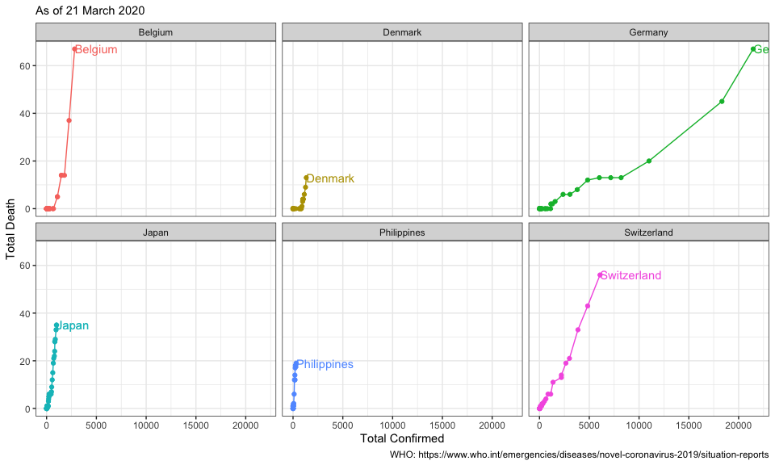

## link: [WHO Coronavirus disease (COVID-2019) situation reports](https://www.who.int/emergencies/diseases/novel-coronavirus-2019/situation-reports/)


```r
dat <- 
  "data/dat_cofdeath.csv" %>% 
  read.csv(stringsAsFactors = F)

g <-
  dat %>% 
  ggplot()+
  aes(Confirmed, Death, color = Area)+
  geom_point()+
  geom_path()+
  geom_text(data = dat %>% 
              group_by(Area) %>% 
              filter(Death == max(Death) & 
                       Confirmed == max(Confirmed)),
            aes(label = Area, x = Confirmed + 20),
            hjust = 0)+
#  scale_x_continuous(limits = c(0, 3000))+
  theme_bw()+
  theme(legend.position = "none")
g
```

<!-- -->

```r
g_jp_G <-
  dat %>%
  filter(Area %in% c("Japan", "Germany")) %>% 
  ggplot()+
  aes(Confirmed, Death, color = Area)+
  geom_point()+
  geom_path()+
  geom_text(data = dat %>% 
              filter(Area %in% c("Japan", "Germany")) %>% 
              group_by(Area) %>% 
              filter(Death == max(Death) & 
                       Confirmed == max(Confirmed)),
            aes(label = Area, x = Confirmed + 20),
            hjust = 0)+
  scale_x_continuous(limits = c(0, 6500))+
  theme_bw()+
  theme(legend.position = "none")

g_jp_G
```

<!-- -->


```r
g + 
  facet_wrap(~Area)
```

<!-- -->


```r
dat_week <-
  dat %>% 
  mutate(Date = ymd(Date)) %>% 
  arrange(desc(Date)) %>% 
  group_by(Area) %>% 
  mutate(tag = if_else(Date == max(Date), 0, 1),
         tag = cumsum(tag) %% 7)

dat_week %>% 
  ggplot()+
  aes(Confirmed, Death, color = Area)+
  geom_point()+
  geom_path()+
  geom_text(data = dat %>% 
              group_by(Area) %>% 
              filter(Death == max(Death) & 
                       Confirmed == max(Confirmed)),
            aes(label = Area, x = Confirmed + 20),
            hjust = 0)+
  geom_vline(data = dat_week %>% filter(tag == 0),
             aes(xintercept = Confirmed), linetype = "dotted")+
#  scale_x_continuous(limits = c(0, 3000))+
  theme_bw()+
  theme(legend.position = "none")+
  facet_wrap(~Area)
```

<!-- -->


```r
dat_week %>% 
  filter(Area %in% c("Japan", "Germany")) %>% 
  ggplot()+
  aes(Confirmed, Death, color = Area)+
  geom_point()+
  geom_path()+
  geom_text(data = dat %>% 
              filter(Area %in% c("Japan", "Germany")) %>%
              group_by(Area) %>% 
              filter(Death == max(Death) & 
                       Confirmed == max(Confirmed)),
            aes(label = Area, x = Confirmed + 20),
            hjust = 0)+
  geom_vline(data = dat_week %>%
               filter(tag == 0) %>%
               filter(Area %in% c("Japan", "Germany")),
             aes(xintercept = Confirmed), linetype = "dotted")+
#  scale_x_continuous(limits = c(0, 3000))+
  theme_bw()+
  theme(legend.position = "none")+
  facet_wrap(~Area, scales = "free_x")
```

<!-- -->


```r
dat %>% 
  filter(Area == "Germany") %>% 
  filter(Death >= 2) %>% 
  lm(Death ~ Confirmed, data = .) %>% 
  summary()
```

```
## 
## Call:
## lm(formula = Death ~ Confirmed, data = .)
## 
## Residuals:
##     Min      1Q  Median      3Q     Max 
## -0.6577 -0.4668 -0.2162  0.2270  1.1412 
## 
## Coefficients:
##               Estimate Std. Error t value Pr(>|t|)    
## (Intercept) -0.6756102  0.5602100  -1.206    0.273    
## Confirmed    0.0023841  0.0001631  14.617 6.44e-06 ***
## ---
## Signif. codes:  0 '***' 0.001 '**' 0.01 '*' 0.05 '.' 0.1 ' ' 1
## 
## Residual standard error: 0.7634 on 6 degrees of freedom
## Multiple R-squared:  0.9727,	Adjusted R-squared:  0.9681 
## F-statistic: 213.7 on 1 and 6 DF,  p-value: 6.436e-06
```
