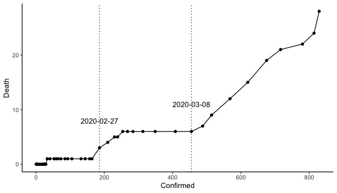
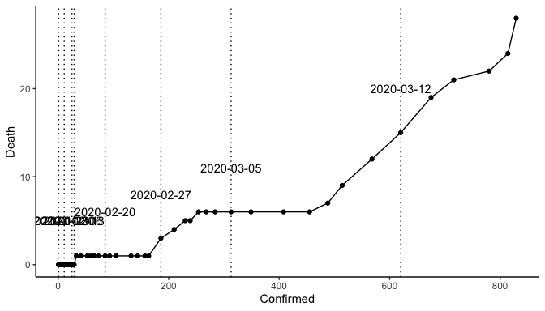

## link: [WHO Coronavirus disease (COVID-2019) situation reports](https://www.who.int/emergencies/diseases/novel-coronavirus-2019/situation-reports/)


```r
library(tidyverse)
library(ggrepel)
library(lubridate)
```


```r
dat <- 
  "data/corona_conf_death_jp.csv" %>% 
  read.csv(stringsAsFactors = F) %>% 
  filter(!is.na(Confirmed)) %>% 
  mutate(Date = ymd(Date))
```


```
##          Date Confirmed Death
## 52 2020-03-12       620    15
## 53 2020-03-13       675    19
## 54 2020-03-14       716    21
## 55 2020-03-15       780    22
## 56 2020-03-16       814    24
## 57 2020-03-17       829    28
```


```r
.date <-
  c("2020-02-27", "2020-03-08") %>% 
  ymd()

dat %>% 
  ggplot()+
  aes(Confirmed, Death)+
  geom_path()+
  geom_point()+
  geom_vline(data = dat %>% filter(Date %in% .date),
             aes(xintercept = Confirmed), 
             linetype = "dotted")+ 
  geom_text(data = dat %>% filter(Date %in% .date),
            aes(label = Date, y = Death + 5))+
  theme_classic()
```

<!-- -->

```r
.date <- 
  dat %>% 
  rowid_to_column() %>% 
  mutate(rowid = rowid - 38) %>% 
  filter(rowid %% 7 == 0) %>% 
  .$Date

dat %>% 
  ggplot()+
  aes(Confirmed, Death)+
  geom_path()+
  geom_point()+
  geom_vline(data = dat %>% filter(Date %in% .date),
             aes(xintercept = Confirmed), 
             linetype = "dotted")+ 
  geom_text(data = dat %>% filter(Date %in% .date),
            aes(label = Date, y = Death + 5))+
  theme_classic()
```

<!-- -->
