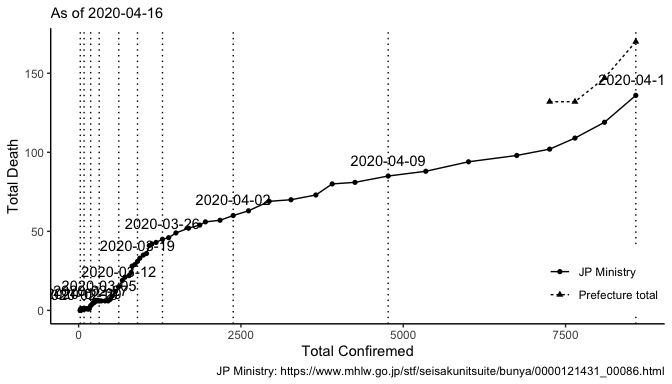
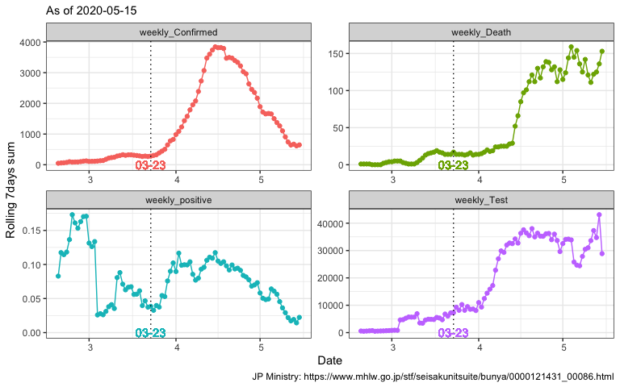

## link: [WHO Coronavirus disease (COVID-2019) situation reports](https://www.who.int/emergencies/diseases/novel-coronavirus-2019/situation-reports/)


```r
library(tidyverse)
library(ggrepel)
library(lubridate)
library(DT)
library(data.table)
```


```r
dat <- 
  "data/corona_jp.csv" %>% 
  fread(data.table = F) %>% 
  filter(!is.na(Confirmed)) %>% 
  mutate(Date = ymd(Date)) %>%
  arrange(Date) %>% 
  mutate(from = "JP Ministry")
```


```r
.day <- 
  dat$Date %>% max %>% as.character

.subtitle <- str_c("As of ", .day)
```


```
##          Date Confirmed  Test Death comment        from
## 59 2020-04-10      5347 68771    88         JP Ministry
## 60 2020-04-11      6005 74891    94         JP Ministry
## 61 2020-04-12      6748 77381    98         JP Ministry
## 62 2020-04-13      7255 78702   102         JP Ministry
## 63 2020-04-14      7645 89551   109         JP Ministry
## 64 2020-04-15      8100 94236   119         JP Ministry
```


```r
gg_cdplot <- 
  function(dat, .date){
    dat %>% 
      ggplot()+
      aes(Confirmed, Death)+
      geom_path()+
      geom_point(aes(shape = from))+
      geom_vline(data = dat %>% filter(Date %in% .date),
                 aes(xintercept = Confirmed), 
                 linetype = "dotted")+ 
      geom_text(data = dat %>% filter(Date %in% .date),
                aes(label = Date, y = Death + 10))+
      theme_classic()+
      labs(subtitle = .subtitle,
           caption = "JP Ministry: https://www.mhlw.go.jp/stf/seisakunitsuite/bunya/0000121431_00086.html")+
      xlab("Total Confiremed")+
      ylab("Total Death")+
      theme(legend.title = element_blank(),
            legend.position = c(0.9, 0.15))
  }
```


```r
.date <-
  dat %>% 
  rowid_to_column() %>% 
  mutate(rowid = rowid - max(rowid)) %>% 
  filter(rowid %% 7 == 0) %>% 
  .$Date


g1 <-
  dat %>% 
  gg_cdplot(.date)+
  scale_x_continuous(limits = c(0, max(dat$Confirmed) + 15))

g1
```

<!-- -->


```r
dat_d <-
  dat %>% 
  mutate(weekly_Death = Death - lag(Death, 7),
         weekly_Confirmed = Confirmed - lag(Confirmed, 7),
         weekly_Test = Test - lag(Test, 7),
         weekly_positive = weekly_Confirmed / weekly_Test)

g2 <-
  dat_d %>%
  select(Date, starts_with("weekly")) %>% 
  pivot_longer(cols = starts_with("weekly")) %>%
  filter(!is.na(value)) %>% 
  ggplot()+
  aes(Date, value, color = name)+
  geom_point()+
  geom_path()+
  theme_bw()+
  facet_wrap(~name, scales = "free", nrow = 2)+
  scale_y_continuous(limits = c(0, NA))+
  theme(legend.position = "none")+
  xlab("Date")+
  ylab("Weekly total value")+
  labs(subtitle = .subtitle,
       caption = "JP Ministry: https://www.mhlw.go.jp/stf/seisakunitsuite/bunya/0000121431_00086.html")
```


```
## Warning in (function (..., na.rm = FALSE) : 引数は部分的に再利用されます
```

<!-- -->

```
## Warning in (function (..., na.rm = FALSE) : 引数は部分的に再利用されます
```


```r
g2+
  geom_vline(xintercept = c("2020-03-23") %>% ymd,
             linetype = "dotted")+
  geom_text(aes(label = "03-23",
                x = "2020-03-23" %>% ymd,
                y = 0))
```

<!-- -->


```r
dat %>% 
  filter(Date >= ymd("2020-04-01")) %>% 
  lm(Death ~ Confirmed, data = .) %>% 
  summary()
```

```
## 
## Call:
## lm(formula = Death ~ Confirmed, data = .)
## 
## Residuals:
##     Min      1Q  Median      3Q     Max 
## -4.1903 -1.2524 -0.7523  1.8577  5.0920 
## 
## Coefficients:
##              Estimate Std. Error t value Pr(>|t|)    
## (Intercept) 3.993e+01  1.903e+00   20.98 2.08e-11 ***
## Confirmed   9.133e-03  3.719e-04   24.56 2.81e-12 ***
## ---
## Signif. codes:  0 '***' 0.001 '**' 0.01 '*' 0.05 '.' 0.1 ' ' 1
## 
## Residual standard error: 2.788 on 13 degrees of freedom
## Multiple R-squared:  0.9789,	Adjusted R-squared:  0.9773 
## F-statistic: 603.1 on 1 and 13 DF,  p-value: 2.809e-12
```


