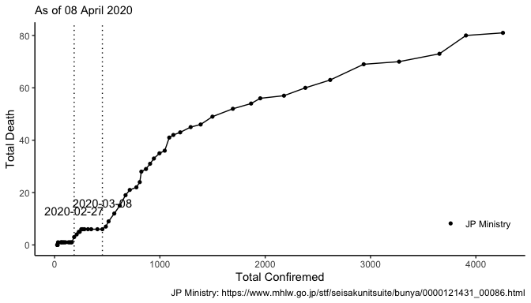

## link: [WHO Coronavirus disease (COVID-2019) situation reports](https://www.who.int/emergencies/diseases/novel-coronavirus-2019/situation-reports/)


```r
library(tidyverse)
library(ggrepel)
library(lubridate)
```


```r
dat <- 
  "data/corona_conf_death_jp.csv" %>% 
  read.csv(stringsAsFactors = F) %>% 
  filter(!is.na(Confirmed)) %>% 
  mutate(Date = ymd(Date)) %>% 
  mutate(from = if_else(Date <= "2020-03-17",
                        "WHO", "JP Ministry"))
```


```
##          Date Confirmed Death        from
## 70 2020-03-29      1693    52 JP Ministry
## 71 2020-03-30      1866    54 JP Ministry
## 72 2020-03-31      1953    56 JP Ministry
## 73 2020-04-01      2178    57 JP Ministry
## 74 2020-04-02      2318    60 JP Ministry
## 75 2020-04-03      2617    63 JP Ministry
```


```r
gg_cdplot <- 
  function(dat, .date){
    dat %>% 
      ggplot()+
      aes(Confirmed, Death)+
      geom_path()+
      geom_point(aes(shape = from))+
      geom_vline(data = dat %>% filter(Date %in% .date),
                 aes(xintercept = Confirmed), 
                 linetype = "dotted")+ 
      geom_text(data = dat %>% filter(Date %in% .date),
                aes(label = Date, y = Death + 10))+
      theme_classic()+
  labs(subtitle = .subtitle,
       caption = "JP Ministry: https://www.mhlw.go.jp/stf/seisakunitsuite/bunya/0000121431_00086.html
       WHO: https://www.who.int/emergencies/diseases/novel-coronavirus-2019/situation-reports/")+
  xlab("Total Confiremed")+
  ylab("Total Death")+
      theme(legend.title = element_blank(),
            legend.position = c(0.9, 0.15))
  }
```


```r
.date <-
  c("2020-02-27", "2020-03-08") %>% 
  ymd()

dat %>% 
  gg_cdplot(.date)
```

<!-- -->

```r
.date <- 
  dat %>% 
  rowid_to_column() %>% 
  mutate(tag = ifelse(Date == "2020-02-27", rowid,0),
         tag = sum(tag)) %>% 
  mutate(rowid = rowid - tag) %>% 
  filter(rowid %% 7 == 0) %>% 
  .$Date

dat %>% 
  gg_cdplot(.date)+
  scale_x_continuous(limits = c(0, max(dat$Confirmed) + 15))
```

<!-- -->

```r
.date <-
  dat %>% 
  rowid_to_column() %>% 
  mutate(rowid = rowid - max(rowid)) %>% 
  filter(rowid %% 7 == 0) %>% 
  .$Date


g1 <-
  dat %>% 
  gg_cdplot(.date)+
  scale_x_continuous(limits = c(0, max(dat$Confirmed) + 15))
```


```r
dat_d <-
  dat %>% 
  mutate(weekly_Death = Death - lag(Death, 7),
         weekly_Confirmed = Confirmed - lag(Confirmed, 7))

g2 <-
  dat_d %>%
  select(Date, weekly_Death, weekly_Confirmed) %>% 
  pivot_longer(cols = c(weekly_Confirmed, weekly_Death)) %>%
  filter(!is.na(value)) %>% 
  ggplot()+
  aes(Date, value, color = name)+
  geom_point()+
  geom_path()+
  theme_bw()+
  facet_wrap(~name, scales = "free", nrow = 1)+
  theme(legend.position = "none")+
  xlab("Date")+
  ylab("Weekly total value")+
  labs(subtitle = .subtitle,
       caption = "JP Ministry: https://www.mhlw.go.jp/stf/seisakunitsuite/bunya/0000121431_00086.html
       WHO: https://www.who.int/emergencies/diseases/novel-coronavirus-2019/situation-reports/")
```


```
## Warning in (function (..., na.rm = FALSE) : 引数は部分的に再利用されます
```

<!-- -->


```r
dat %>% 
  filter(Date >= ymd("2020-03-08")) %>% 
  lm(Death ~ Confirmed, data = .) %>% 
  summary()
```

```
## 
## Call:
## lm(formula = Death ~ Confirmed, data = .)
## 
## Residuals:
##      Min       1Q   Median       3Q      Max 
## -11.0269  -4.9737   0.3532   4.6349   8.4388 
## 
## Coefficients:
##             Estimate Std. Error t value Pr(>|t|)    
## (Intercept) 3.008661   2.575395   1.168    0.254    
## Confirmed   0.027137   0.001977  13.724 3.84e-13 ***
## ---
## Signif. codes:  0 '***' 0.001 '**' 0.01 '*' 0.05 '.' 0.1 ' ' 1
## 
## Residual standard error: 5.978 on 25 degrees of freedom
## Multiple R-squared:  0.8828,	Adjusted R-squared:  0.8781 
## F-statistic: 188.3 on 1 and 25 DF,  p-value: 3.842e-13
```

```r
dat %>% 
  filter(Date >= ymd("2020-02-26"), 
         Date <= ymd("2020-03-02")) %>% 
  lm(Death ~ Confirmed, data = .) %>% 
  summary()
```

```
## 
## Call:
## lm(formula = Death ~ Confirmed, data = .)
## 
## Residuals:
##        1        2        3        4        5        6 
## -0.42249  0.43961  0.19827  0.16382 -0.30169 -0.07753 
## 
## Coefficients:
##             Estimate Std. Error t value Pr(>|t|)    
## (Intercept) -7.06003    1.03927  -6.793 0.002452 ** 
## Confirmed    0.05172    0.00481  10.754 0.000424 ***
## ---
## Signif. codes:  0 '***' 0.001 '**' 0.01 '*' 0.05 '.' 0.1 ' ' 1
## 
## Residual standard error: 0.3657 on 4 degrees of freedom
## Multiple R-squared:  0.9666,	Adjusted R-squared:  0.9582 
## F-statistic: 115.6 on 1 and 4 DF,  p-value: 0.0004239
```


