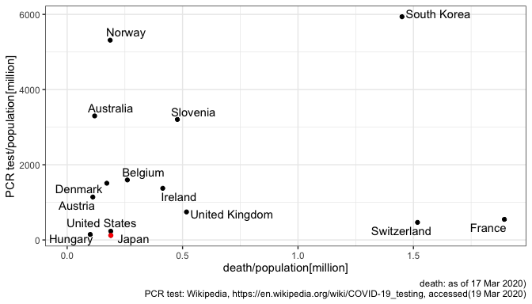

## link: [WHO Coronavirus disease (COVID-2019) situation reports](https://www.who.int/emergencies/diseases/novel-coronavirus-2019/situation-reports/)


```r
dat_confdeath <-
  "data/corona_world.csv" %>% 
  read.csv(stringsAsFactors = F)

dat_PCR <- 
  "data/corona_PCR.csv" %>% 
  read.csv(stringsAsFactors = F) %>% 
  mutate_all(~str_remove(., ",")) %>% 
  filter(!is.na(positive.1000)) %>% 
  mutate_at(c(2, 3, 5, 6, 7), as.numeric)

dat <-
  dat_PCR %>% 
  left_join(dat_confdeath %>% 
              rename(Country = country) %>% 
              mutate(Country = if_else(Country == "Kingdom of Denmark",
                                       "Denmark", Country),
                     Country = if_else(Country == "US",
                                       "United States", Country),
                     Country = if_else(Country == "UK",
                                       "United Kingdom", Country),
                     Country = if_else(Country == "Republic of Indonesia",
                                       "Indonesia", Country)),
            by = "Country") %>% 
  filter(!is.na(death)) %>% 
  filter(death > 0)

.count <- "Japan"

dat_g <-
  dat %>% 
  arrange(death/population) %>% 
  mutate(Country = factor(Country, levels = .$Country)) %>% 
  mutate(col = if_else(Country %in% .count, "red", "black")) %>% 
  mutate(ratio = death/population) %>% 
  filter(ratio >= 0.1)

dat_g %>% 
  filter(Country != "Italy") %>% 
  ggplot()+
  aes(ratio, test.million)+
  geom_point()+
  geom_point(data = dat_g %>% filter(Country == "Japan"),
             color = "red")+
  geom_text_repel(aes(label = Country))+
  scale_x_continuous(limits = c(0, NA))+
  theme_bw()+
  ylab("PCR test/population[million]")+
  xlab("death/population[million]")+
  labs(caption = "death: as of 17 Mar 2020)
       PCR test: Wikipedia, https://en.wikipedia.org/wiki/COVID-19_testing, accessed(19 Mar 2020)")
```

<!-- -->

```r
dat_g %>% 
  filter(Country %in% c("Japan", "United States", "Hungary")) %>% 
  select(Country, Total, Positive, death, population, test.million, ratio) %>% 
  rename(death.million = ratio)
```

```
##         Country Total Positive death population test.million death.million
## 1       Hungary  1470       39     1    10.0000          147     0.1000000
## 2 United States 76495     7731    62   328.3047          233     0.1888489
## 3         Japan 15354      868    24   126.8926          121     0.1891364
```


