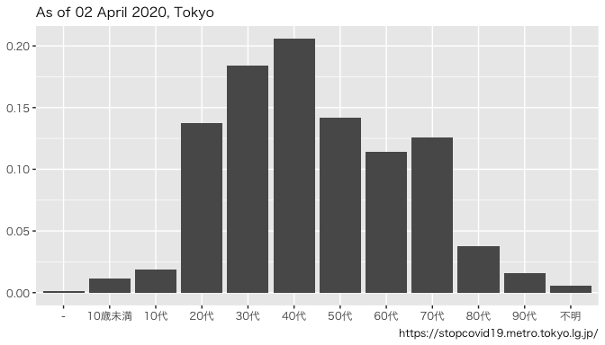
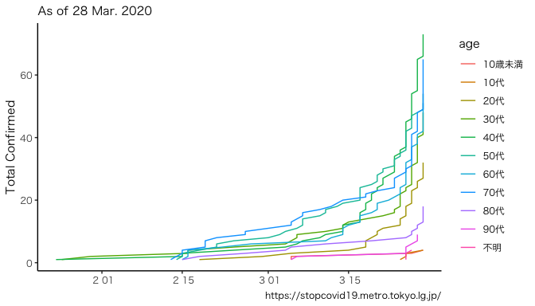

```r
.url <- "https://stopcovid19.metro.tokyo.lg.jp/data/130001_tokyo_covid19_patients.csv"

dat_raw <- 
  .url %>% 
  fread(data.table = F)
```


```r
dat <-
  dat_raw %>% 
  rename(date = 公表_年月日,
         age = 患者_年代) %>% 
  mutate(date = ymd(date)) %>% 
  mutate(age = if_else(age == "", "不明", age),
         age = if_else(age == "-", "不明", age))

asof <- 
  dat$date %>% 
  max %>% 
  as.character()

.subtitle <- 
  str_c("As of ", asof,", Tokyo")

dat_nest_age <-
  dat %>% 
  group_nest(age) %>% 
  mutate(n = map_dbl(data, nrow))

dat_nest_age %>% 
  ggplot()+
  aes(age, n/sum(n))+
  geom_bar(stat = "identity")+
  theme(text = element_text(family = "HiraKakuPro-W3"),
        axis.title = element_blank())+
  labs(caption = "https://stopcovid19.metro.tokyo.lg.jp/",
       subtitle = .subtitle)
```

<!-- -->

```r
dat_n <-
  dat %>% 
  group_by(age) %>% 
  mutate(n = 1,
         n = cumsum(n)) %>% 
  ungroup() %>% 
  group_by(age, date) %>% 
  filter(n == max(n)) %>% 
  ungroup()

.xmin <- "2020-01-24" %>% ymd
.xmax <- today() %>% ymd %>% {. + 10}
dat_n %>% 
  ggplot()+
  aes(date, n, color = age)+
  geom_path()+
  geom_point(alpha = 0.5)+
  geom_text(data = dat_n %>%
              group_by(age) %>% 
              filter(date == max(date)),
            aes(label = age), 
            x = today() %>% ymd %>% {. + 3},
            family = "HiraKakuPro-W3")+
  scale_x_date(expand = c(0.1, 2))+
  theme_classic()+
  theme(text = element_text(family = "HiraKakuPro-W3"),
        legend.position = "none",
        axis.title.x = element_blank())+
  labs(caption = "https://stopcovid19.metro.tokyo.lg.jp/",
       subtitle = .subtitle,
       y = "Total Confirmed")
```

<!-- -->


```r
.d <- {asof %>% ymd} - {"2020-01-24" %>% ymd}

.date <- 
  data.frame(x = seq(0, .d),
             date = "2020-01-24" %>% ymd) %>% 
  mutate(date = date + x)

dat_log <-
  dat_n %>% 
  select(age, date, n) %>% 
  group_nest(age) %>% 
  map(data, ~left_join(.date, ., by = "date"))
```

```
## Warning in .f(.x[[i]], ...): data set '.x[[i]]' not found
```

```
## Warning in .f(.x[[i]], ...): data set '~left_join(.date, ., by = "date")' not
## found
```

```
## Warning in .f(.x[[i]], ...): data set '.x[[i]]' not found
```

```
## Warning in .f(.x[[i]], ...): data set '~left_join(.date, ., by = "date")' not
## found
```
