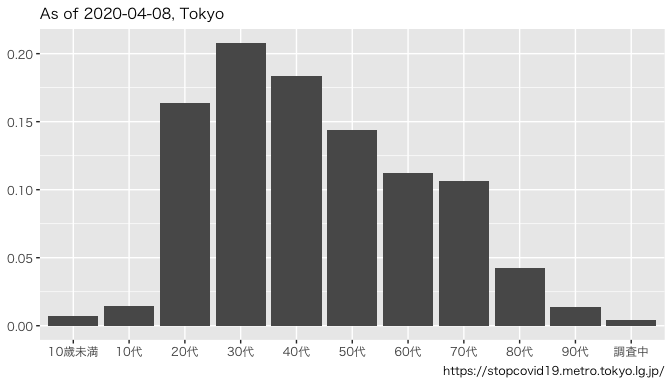
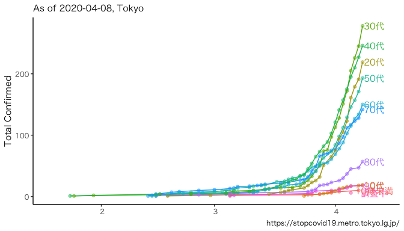

```r
dat_raw <- "data" %>% 
  list.files(full.names = TRUE) %>% 
  str_subset("patients.csv") %>% 
  fread(data.table = F)
```


```r
dat <-
  dat_raw %>% 
  rename(date = 公表_年月日,
         age = 患者_年代) %>% 
  mutate(date = ymd(date)) %>% 
  mutate(age = if_else(age == "", "不明", age))

dat_nest_age <-
  dat %>% 
  group_nest(age) %>% 
  mutate(n = map_dbl(data, nrow))

dat_nest_age %>% 
  ggplot()+
  aes(age, n/sum(n))+
  geom_bar(stat = "identity")+
  theme(text = element_text(family = "HiraKakuPro-W3"),
        axis.title = element_blank())+
  labs(caption = "https://stopcovid19.metro.tokyo.lg.jp/",
       subtitle = .subtitle)
```

<!-- -->

```r
dat %>% 
  group_by(age) %>% 
  mutate(n = 1,
         n = cumsum(n)) %>% 
  ggplot()+
  aes(date, n, color = age)+
  geom_path()+
  theme_classic()+
  theme(text = element_text(family = "HiraKakuPro-W3"),
        axis.title.x = element_blank())+
  labs(caption = "https://stopcovid19.metro.tokyo.lg.jp/",
       subtitle = .subtitle,
       y = "Total Confirmed")
```

<!-- -->
