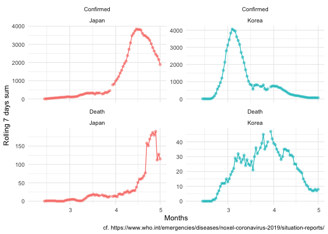

```r
library(tidyverse)
library(patchwork)
library(data.table)
library(lubridate)
```


```r
dat <- 
  "data/Korea_JP.csv" %>% 
  fread(data.table = F) %>% 
  filter(! is.na(Confirmed)) %>% 
  mutate(Date = ymd(Date))
```


```r
g_conf_death <-
  dat %>% 
  mutate(Country = if_else(Country == "Korea",
                           "Republic of Korea",
                           Country)) %>% 
  ggplot()+
  aes(Confirmed, Death, color = Country)+
  geom_path()+
  geom_point(alpha = 0.5)+
  theme_minimal()+
  theme(legend.position = "top")+
  xlab("Total Confirmed")+
  ylab("Total Death")
```


```r
dat_long <-
  dat %>% 
  pivot_longer(cols = c(Confirmed, Death))

dat_lag_7days <-
  dat_long %>% 
  mutate(Date = Date + 7) %>% 
  rename(lag7day = value)

dat_weekly <-
  left_join(dat_long, dat_lag_7days, 
            by = c("Date", "Country", "name")) %>% 
  mutate(weekly = value - lag7day)
```


```r
g_rollingsum <-
  dat_weekly %>% 
  ggplot()+
  aes(Date, weekly, color = Country)+
  geom_path()+
  geom_point(alpha = 0.5)+
  facet_wrap(~name, scales = "free_y")+
  theme_minimal()+
  theme(legend.position = "none")+
  ylab("Rolling 7 days sum")+
  xlab("Months")+
  labs(caption = "cf. https://www.who.int/emergencies/diseases/noxel-coronavirus-2019/situation-reports/")
```


```r
wrap_plots(g_conf_death, g_rollingsum,
           nrow = 2,
           heights = c(1.5,1))
```

```
## Warning: Removed 28 rows containing missing values (geom_path).
```

```
## Warning: Removed 32 rows containing missing values (geom_point).
```

<!-- -->
